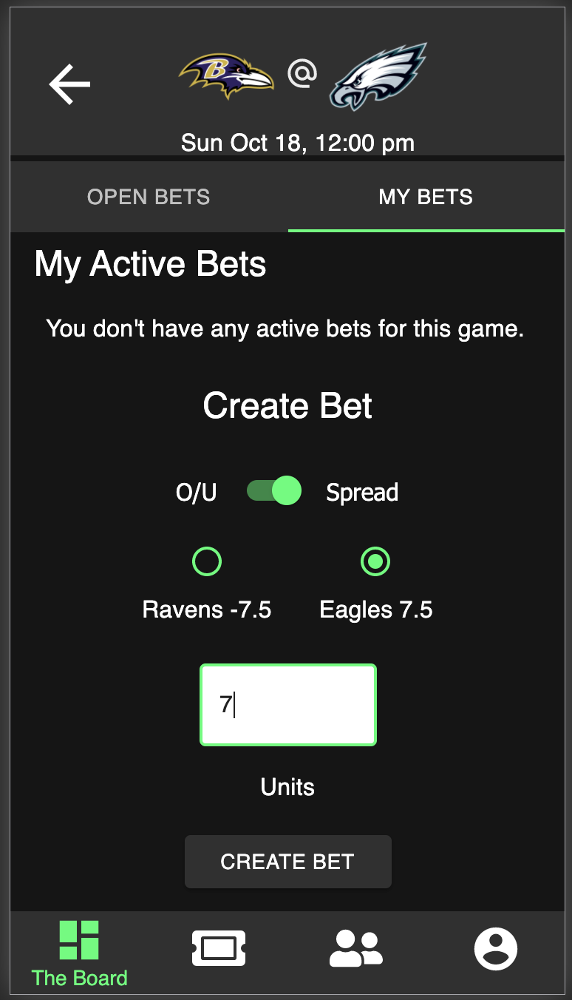
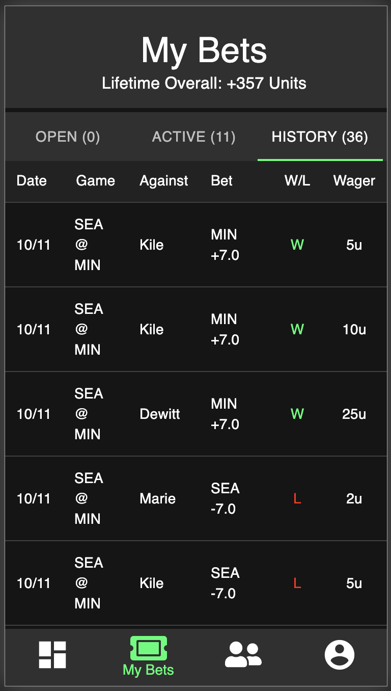

# betting-app-reactjs
«Friendly Wager» est une application mobile qui vous permet de créer et d'accepter des paris sur les jeux NFL entre vous et vos amis. Il existe deux types de paris que vous pouvez faire ou accepter de vos amis - 1) le plus / moins et 2) le spread. Cette application utilise deux API différentes pour afficher automatiquement les jeux de la semaine en cours, les cotes des paris et calculer le gagnant de ces paris.

Une fois connecté, l'utilisateur est d'abord amené à la page principale, que nous appelons «The Board». Sur «The Board», l'utilisateur pourra voir tous les paris ouverts de son ami (paris qui n'ont été acceptés par aucun utilisateur) et s'il le souhaite, accepter l'un de ces paris. Si un pari ouvert est accepté, ce pari devient un «pari actif», qui ne peut être accepté par aucun autre utilisateur. «The Board» affiche également tous les jeux de la semaine en cours et donne à l'utilisateur la possibilité de faire un nouveau pari ouvert qui peut être accepté par n'importe lequel de ses amis.

L'application propose également une fonction de liste d'amis où l'utilisateur peut voir tous ses amis actuels, ainsi que rechercher de nouveaux amis par leur nom ou leur e-mail. Une fois que les utilisateurs sont amis, ils peuvent accéder à la page `` Statistiques '' de chacun pour voir tous les paris ouverts de l'utilisateur ainsi que des informations statistiques telles que leurs paris totaux. Dans le profil de chaque utilisateur individuel, ils peuvent également ajouter une photo de profil.

L'utilisateur a également la possibilité de voir tous ses propres «paris ouverts», «paris actifs» et «informations historiques» des paris qu'il a gagnés et perdus. Les informations historiques sont calculées à la fin de chaque semaine.

## Captures d'écran

  
  
  

## Documentation sur la portée

[Document sur la portée] (https://docs.google.com/document/d/1qmDVfkszY-7yAiPjYXER2lU0fy-7U8VJdfEAs3Vxxiw/edit?usp=sharing)

## Conditions préalables

Avant de commencer, assurez-vous que les logiciels suivants sont installés sur votre ordinateur:

- [Node.js] (https://nodejs.org/en/)
- [PostrgeSQL] (https://www.postgresql.org/)
- [Nodemon] (https://nodemon.io/)

## Créer une base de données et une table

Créez une nouvelle base de données dans PostgreSQL appelée 'friendly_wager'. Une fois cette opération terminée, exécutez tout le code sql dans le fichier database.sql pour créer la structure initiale de la base de données. Ce fichier comprend des tableaux pour les utilisateurs, les amis, les jeux, les équipes et les paris.

Si vous souhaitez donner un autre nom à votre base de données, vous devrez remplacer «friendly_wager» par le nom de votre nouveau nom de base de données dans «server / modules / pool.js».

## Création du fichier .ENV

Créez un fichier `.env` à la racine du projet et collez cette ligne dans le fichier:
 ''
SERVER_SESSION_SECRET = **********************
CLIENT_ID = ***********************
CLIENT_SECRET = **********************
ODDS_KEY = ***********************
''
Vous devrez d'abord établir un SERVER_SESSION_SECRET pour assurer la sécurité de votre application. Voici un site qui peut vous aider à générer un secret: https://passwordsgenerator.net/. REMARQUE Ce secret doit comporter plus de 8 caractères. Avoir une clé secrète de moins de 8 caractères ou la laisser comme "superDuperSecret" entraînera un avertissement de l'application.
  
L'identifiant client NFL et le secret client doivent être demandés à la NFL et leur utilisation est assez restrictive. Envoyez-leur un e-mail à fantasy.football@nfl.com.
La clé Odds Api peut être demandée à [l'API Odds] (https://the-odds-api.com/). Une option gratuite est disponible avec 500 utilisations par mois.

## Installation

1. Exécutez npm install
2. Démarrez Postgres à l'aide des services de brassage. Démarrez postgresql
   (requis uniquement si PG n'est pas déjà en cours d'exécution)
3. Exécutez le serveur d'exécution npm
4. Exécutez le client d'exécution npm
5. Accédez à localhost: 3000

## Comment utiliser Friendly Wager

Un nouvel utilisateur s'inscrira d'abord pour un compte en utilisant son e-mail. Après son inscription, l'utilisateur sera amené à «The Board».

   ### Le tableau

  L'utilisateur est initialement dirigé vers une page appelée le tableau. Le tableau se compose de deux onglets, «Open Bets» et «Games». Dans "Open Bets", l'utilisateur pourra voir tous les paris ouverts de ses amis qui n'ont encore été acceptés par aucun autre utilisateur. L'utilisateur peut alors cliquer sur ce pari ouvert et choisir d'accepter le pari. Notez que si l'utilisateur vient de s'inscrire, il n'aura aucun pari ouvert affiché car vous devez d'abord être ami.
  L’utilisateur peut également accéder à l’onglet «Jeux». Dans l’onglet «Jeux», une liste de tous les matchs de la semaine NFL en cours ainsi que l’heure prévue du match et les cotes des paris sont affichées. Si un utilisateur clique sur un jeu spécifique, il sera redirigé vers une page qui montre tous les paris ouverts de ses amis, mais uniquement pour ce jeu spécifique. Ils peuvent cliquer sur l'onglet correspondant pour faire un pari. Pour faire un pari, vous choisissez d'abord le type de pari que vous souhaitez créer (Over / Under ou spread) et le montant d'unités que vous souhaitez miser. Après avoir confirmé votre pari, ce pari sera affiché dans «Mes paris ouverts» pour ce jeu et sera disponible pour que vos amis acceptent ce pari.

  ### Mes paris
 
  À l’aide de la barre de navigation inférieure, l’utilisateur peut cliquer sur l’onglet «Mes paris». Cela amènera l'utilisateur à une page où il pourra consulter ses paris ouverts, ses paris actifs et l'historique des semaines précédentes pour savoir s'il a gagné ou perdu le pari. Les informations de «l'historique» seront automatiquement mises à jour chaque semaine une fois les jeux terminés.

  ### Amis

  À l'aide de la barre de navigation inférieure, l'utilisateur peut cliquer sur l'onglet "Amis" pour accéder à sa liste d'amis. Ici, ils peuvent voir tous leurs amis actuels avec la fonctionnalité de recherche incluse. Si un utilisateur souhaite voir plus d'informations sur cet ami, il peut simplement cliquer sur cet ami et il sera redirigé vers la page "Statistiques des amis". Dans la page "Statistiques des amis", vous pouvez voir l'historique des paris entre vous et cet ami. La page "Statistiques des amis" affichera également tous les paris ouverts actuellement disponibles pour un ami.
  Si un utilisateur souhaite ajouter un ami, il clique simplement sur le symbole «+» en haut à droite de la page de la liste d'amis. Ici, l'utilisateur peut rechercher n'importe quel utilisateur dans le pari convivial pour ajouter cet ami. Si vous cliquez sur Ajouter, vous deviendrez amis et leurs paris ouverts seront disponibles immédiatement. Vos paris ouverts seront également disponibles pour cet utilisateur.

  ### Profil

  Enfin, à l'aide de la barre de navigation, l'utilisateur peut accéder à la page Profil. Ici, il affichera les informations de profil ainsi que la possibilité de changer votre photo de profil. Pour changer votre photo de profil, cliquez simplement sur «Modifier l'image de profil» et soumettez une URL valide.

## Construit avec

* React.js
* Redux-Sagas
* Matériel UI
* CSS
* Moment.js
* Node.js
* Node-cron
* Express
* PostgreSQL
* API NFL
* l'API Odds

(Une liste complète des dépendances peut être trouvée dans package.json)

## Remerciements

* Tout d'abord, notre équipe tient à remercier Paul Kelley, notre client. C'est lui qui a eu l'idée du `` pari amical '' et nous a inspiré pour implémenter des fonctionnalités qui surpassent toutes les autres applications de paris sportifs.
* Nous tenons également à remercier [Prime Digital Academy] (https://www.primeacademy.io) pour nous avoir mis en relation avec Paul Kelley et nous avoir préparés techniquement à créer un 'Friendly Wager'
* Dernier point et non des moindres, nous tenons à remercier notre cohorte Rabin d'être le groupe le plus solidaire que nous aurions pu imaginer. Et un ÉNORME bravo à nos instructeurs, Dane Smith et Kris Szafranski pour nous avoir appris à coder.

## Support

Pour toute question, préoccupation ou suggestion, n'hésitez pas à contacter l'un de nous à:

* Ninjaroot-509 - stanleycastin19@gmail.com